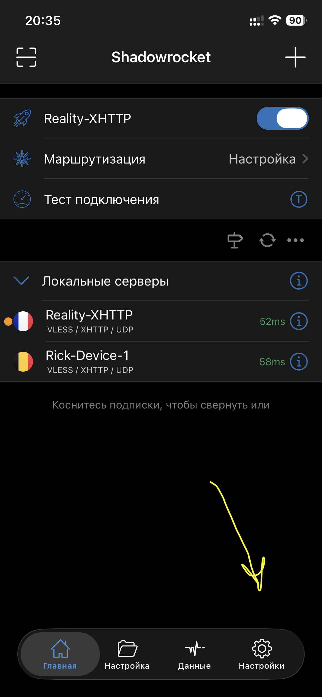
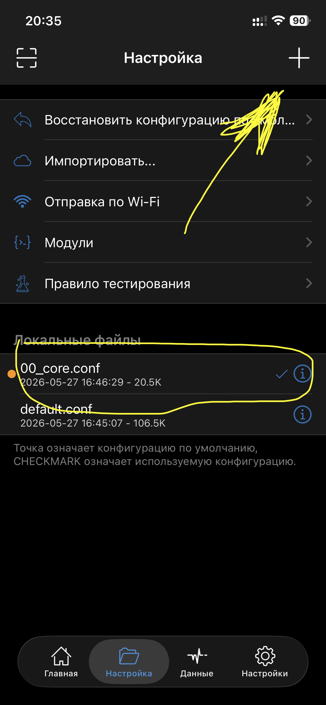
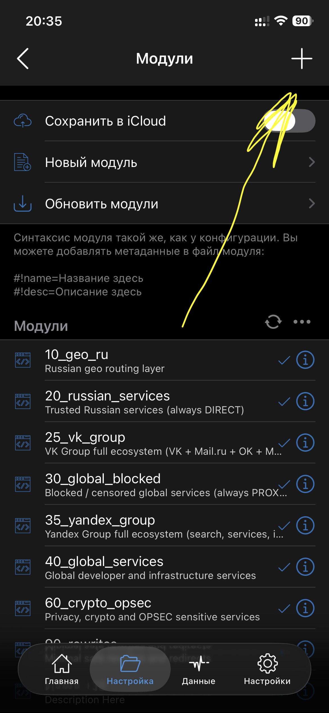
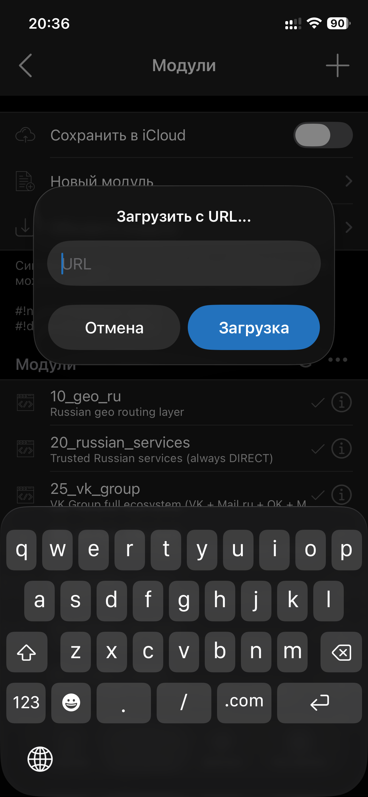

# Adding rules to Shadowrocket

[English](instructions.md) | [Русский](instructions.ru.md)

This guide shows how to use a ready-made profile or add independently switchable
modules. Screenshots use the Russian Shadowrocket interface; button positions are
the same in other interface languages. Names visible in screenshots may differ
from current module filenames as the project evolves.

## Before you start

You need:

- Shadowrocket from the [App Store](https://apps.apple.com/app/shadowrocket/id932747118);
- a working proxy node that is assigned to a policy named `PROXY`;
- internet access to the Raw GitHub URL.

The repository provides routing rules only. It does not provide a proxy server,
subscription, credentials, or network access.

## Option A: import a ready-made profile

Use this option when you want the simplest setup.

1. Choose one of the files in [`shadowrocket/builds`](../shadowrocket/builds):
   `minimal.conf`, `advanced.conf`, or `full.conf`.
2. Open the file on GitHub and tap **Raw**.
3. Copy the Raw URL.
4. In Shadowrocket, open the **Config** tab and use the download/import action to
   add the remote configuration URL.
5. Select the downloaded configuration and confirm that it has the checkmark.
6. Return to the home screen, choose a proxy node, and enable Shadowrocket.

Do not install a ready-made profile as a module. Profiles contain the complete
configuration; modules are optional additions to an existing configuration.

## Option B: add independent modules

Use this option when you want to enable or disable groups of rules with one tap.

### 1. Open Config

On the Shadowrocket home screen, tap the folder-shaped **Config** tab at the
bottom.

<p align="center"></p>

### 2. Choose the active local configuration

Select the local configuration that should receive the modules. A checkmark marks
the configuration currently in use. Then open **Modules** at the top of the page.

<p align="center"></p>

### 3. Add a module

On the Modules screen, tap the **+** button in the upper-right corner. Existing
modules can be enabled or disabled with their checkmarks.

<p align="center"></p>

### 4. Paste the Raw URL

Open the required file in [`shadowrocket/modules`](../shadowrocket/modules), tap
**Raw** on GitHub, and copy the browser URL. Paste it into **Download from URL**
and tap **Download**.

<p align="center"></p>

Repeat these steps for each required module. Use the [module guide](modules.md) to
decide which ones to install. Shadowrocket can update URL-based modules later
through **Update Modules**.

## Add your own rules

1. Copy [`shadowrocket/custom/custom.example.conf`](../shadowrocket/custom/custom.example.conf).
2. Rename the copy using lowercase kebab-case, for example `my-services.conf`.
3. Add rules according to the [custom rule syntax guide](manual.md).
4. Validate the file before publishing it:

   ```bash
   ./scripts/validate-configs.sh
   ```

5. Commit the file to your repository and import its Raw URL using the module
   steps above.

Never put secrets, proxy credentials, subscription URLs, or private server
addresses in a public module.

## Verify the result

- local network resources remain reachable;
- Russian services that require a Russian IP use `DIRECT`;
- selected international services use `PROXY`;
- authentication, banking, media, and messaging applications still work;
- the module can be disabled and re-enabled without breaking the base configuration.

If routing is wrong, disable the most recently added module first and check its
order. Shadowrocket applies routing rules from top to bottom; a broad earlier rule
can hide a more specific later rule.

Return to the [main README](../README.md).
